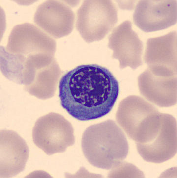
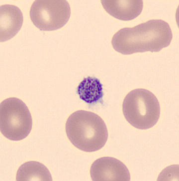

# Introduction

<figure>
<p align="center">
  
  
  
</p>
  <figcaption align="center"><b>Figure.</b> Examples of blood cell types: an erythroblast, a monocyte and a platelet.</figcaption>
</figure>
</br></br>

-----------------------------

Recognizing blood cell types in microscopic images is an important task in clinical diagnostics. Although this problem has been studied for decades, new machine learning and deep learning approaches continue to improve classification accuracy. In the research article by [Acevedo et al. (2019)](https://www.sciencedirect.com/science/article/abs/pii/S0169260719303578?via%3Dihub), the authors were one of the first to apply convolutional neural networks (CNNs) to classify various blood cell types, including different leukocyte subtypes, immature granulocytes, erythroblasts, and platelets. Their best model achieved an overall accuracy of over 96%, demonstrating strong potential for automated blood cell classification.

The dataset used in this project is publicly available on Mendeley Data by [Acevedo et al. (2019)](https://www.sciencedirect.com/science/article/abs/pii/S0169260719303578?via%3Dihub): https://data.mendeley.com/datasets/snkd93bnjr/1. It contains a total of 17,092 images of individual normal cells, which were acquired using a microscope called the analyzer CellaVision DM96 in the Core Laboratory at the Hospital Clinic of Barcelona (i.e. H&E stain images). H&E is the combination of two histological stains: hematoxylin and eosin. The hematoxylin stains cell nuclei a purplish blue, and eosin stains the extracellular matrix and cytoplasm pink, with other structures taking on different shades, hues, and combinations of these colors. The dataset is organized in the following eight groups: neutrophils, eosinophils, basophils, lymphocytes, monocytes, immature granulocytes (promyelocytes, myelocytes, and metamyelocytes), erythroblasts and platelets or thrombocytes. The size of the images is 360 x 363 pixels, in format JPG, and they were annotated by expert clinical pathologists. The images were captured from individuals without infection, hematologic or oncologic disease and free of any pharmacologic treatment at the moment of blood collection.


# Project Overview


I applied transfer learning with a pretrained Xception model as a fixed feature extractor and trained a small neural classification head on top of it. I additionally extracted Xception embeddings and trained classical machine learning models such as logistic regression and XGBoost to provide an interpretable baseline. Hyperparameters such as learning rate and dropout rate were tuned, and the best-performing model achieved strong accuracy on the test set. The classical ML approach also performed well, producing detailed per-class performance metrics. Overall, transfer learning proved to be an effective strategy for immune-cell image classification. I compared my results with those reported by [Acevedo et al 2019](https://www.sciencedirect.com/science/article/abs/pii/S0169260719303578?via%3Dihub).


## 🛠️ Tech Stack

ML | Data Science:

🧠 numpy • pandas • scikit-learn • Keras/Tensorflow • TensorFlow Lite

📊 seaborn • matplotlib


MLOps | Deployment:

🐳 Docker

☁️ AWS Lambda (event-driven, serverless compute service by AWS) • AWS ECR


## Usage

Submit an image URL to the deployed AWS Lambda function via curl. In this example,
platelet_example.png is an H&E-stained platelet image hosted on GitHub:
```{bash}
curl -X POST -H "Content-Type: application/json" -d '{"url": "https://raw.githubusercontent.com/katwre/Immune-cell-classifier-api/main/images/platelet_example.png"}' https://n52ns6pv5ifcgefr76a4zm5m2u0xayxf.lambda-url.eu-west-1.on.aws/
```

Example response - the model returns a probability distribution over the eight immune cell classes:
```{json}
{"predictions": {"basophil": 0.0, "eosinophil": 0.0, "erythroblast": 0.08, "ig": 0.0, "lymphocyte": 0.0, "monocyte": 0.0, "neutrophil": 0.0, "platelet": 0.91}}
```


## Installation

### Organization of the files 

The repository contains:
```{bash}
Immune-cell-classifier-api/
├── notebooks/
    └── Classify_immune_cells.ipynb # Data preparation and cleaning, EDA, feature importance, model selection process, parameter tuning
├── src/
    ├── inference.py # script that loads the model and serves it via a AWS Lambda
    └── test.py # script that contains a possible day that is used to test the model and predict the next day.
├── images/ # images used in the readme
├── Dockerfile # instructions to build the docker image
└── README.md
```

### Deployment

For the production environment, Docker is used to containerize the application and make **deployment** such as AWS Lambda simple and reproducible. Follow the instructions below to build and run the Docker image.

🐳 Build and run the Docker image (locally).

1. Build the image
```{bash}
docker build -t cellclassification-api .
```
2. Run the container locally
```{bash}
docker run -p 8080:8080 cellclassification-api src.inference.lambda_handler
```
3. Test prediction
```{bash}
python3 ./src/test.py
```

🌐 Deploy to AWS Lambda

1. Install & configure the AWS CLI. This sets up your AWS credentials (Access Key, Secret Key, Region).
```{bash}
pip install awscli
aws configure
```
2. Create container registry using Elastic Container Registry (ECR). ECR is where your Docker image will be stored:
```{bash}
aws ecr create-repository --repository-name immunecells-tflite-images
```
3. Log in to ECR
```{bash}
$(aws ecr get-login --no-include-email)
```
4. Define environment variables
```{bash}
ACCOUNT=XXXXXXXXXX # copy paste your aws account if
REGION=eu-west-1
REGISTRY=immunecells-tflite-images
PREFIX=${ACCOUNT}.dkr.ecr.${REGION}.amazonaws.com/${REGISTRY}
TAG=immunecell-model-xception-v4-010 # choose any version tag you like
REMOTE_URL=${PREFIX}:${TAG}
echo ${REMOTE_URL}
```
5. (Optional) Run the container again for a sanity check
```{bash}
docker run -it --rm cellclassification-api
```
6. Create a tag and push the image to ECR:
```{bash}
docker tag cellclassification-api:latest ${REMOTE_URL}
docker push ${REMOTE_URL}
```

🕊️ Create a Lambda Function (Container Image)
1. Go to AWS Lambda → Create function
2. Choose Container image
3. Select your ECR repository
4. Choose the tag we just pushed
5. Create the function


🔗 Create a Lambda Function URL (Public Endpoint). This gives our model an HTTPS endpoint that our frontend or curl can call.
1. Open your Lambda function
2. Go to Configuration → Function URL
3. Click Create function URL
4. Set Auth type: NONE (public demo - later we can restrict access)
5. Save - we get a URL like: https://abcd1234xyz.lambda-url.eu-west-1.on.aws/

🧪 Test Inference via HTTPS:

```{bash}
curl -X POST   -H "Content-Type: application/json"   -d '{"url": "https://raw.githubusercontent.com/katwre/Immune-cell-classifier-api/main/images/erythroblast_example.png"}'   https://n52ns6pv5ifcgefr76a4zm5m2u0xayxf.lambda-url.eu-west-1.on.aws/
```
Example output:
```{json}
{"predictions": {"basophil": 0.0, "eosinophil": 0.0, "erythroblast": 0.89, "ig": 0.01, "lymphocyte": 0.01, "monocyte": 0.08, "neutrophil": 0.01, "platelet": 0.0}}
```

